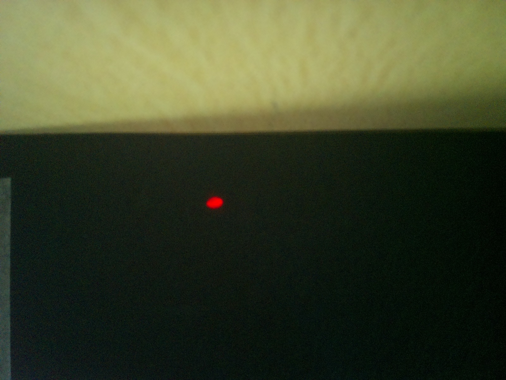
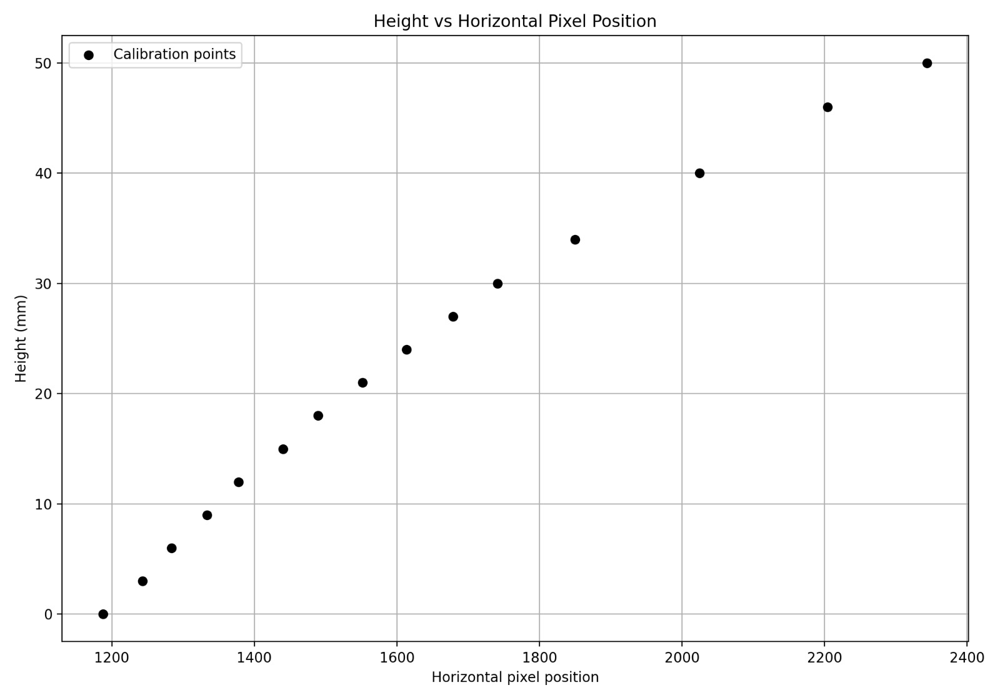
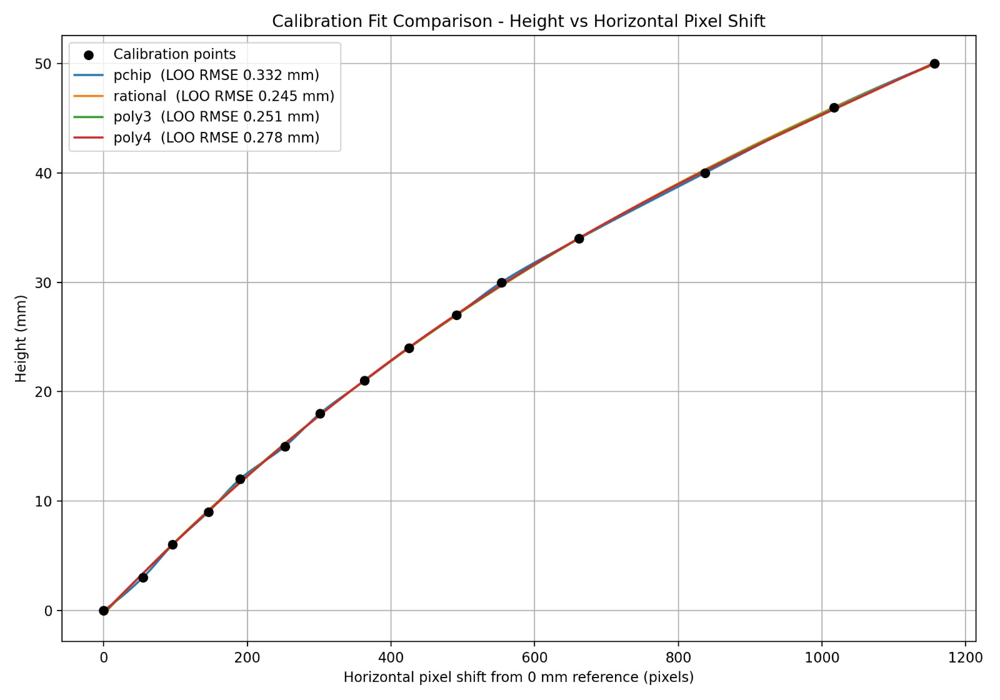
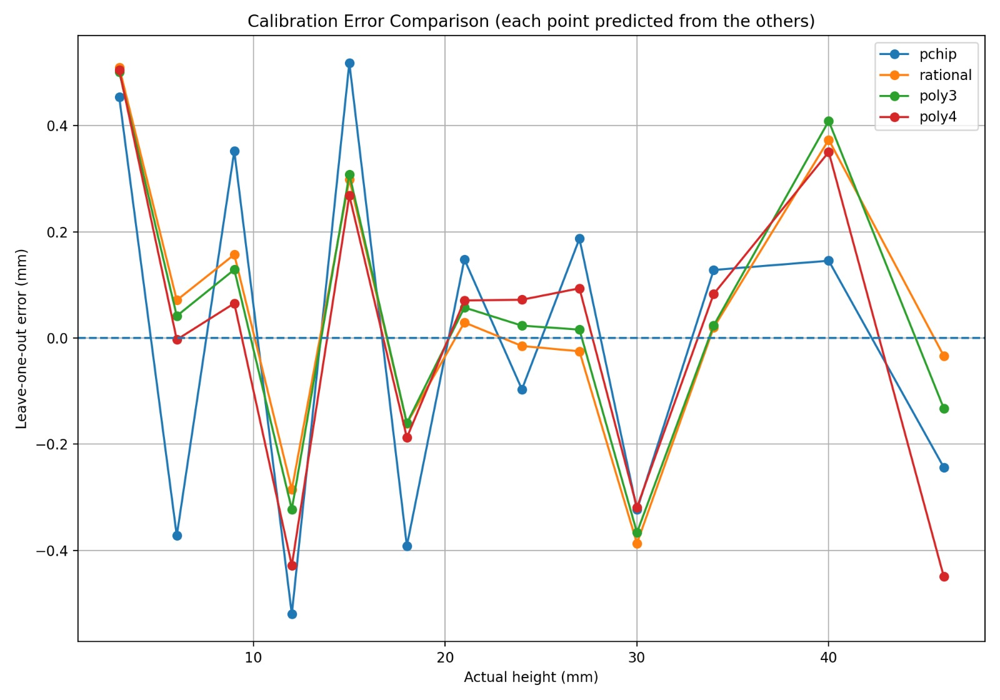
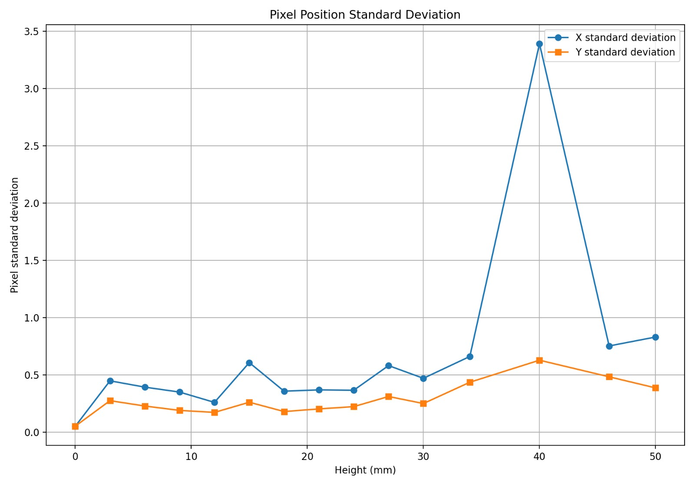

# Raspberry Pi Laser Triangulation

**A camera-based, non-contact height-estimation system using red-laser displacement and a calibrated vision pipeline.**


[System overview](#system-overview) · [Results](#calibration-results) · [Run the project](#run-the-project) · [Documentation](#documentation)

---

## Overview

This project estimates an object's height from the horizontal displacement of a red laser spot in images captured by a Raspberry Pi camera. The software detects the red-dominant spot, estimates its centroid, measures displacement relative to a 0 mm reference, and converts that displacement to height using a calibration model.

The repository includes the measurement and calibration scripts, calibration data and saved model, analysis tables and plots, setup photographs, design references, and project documents.


*Physical experimental setup. Keep the camera, laser, target geometry, and camera settings consistent between calibration and measurement.*

## System overview

| Component | Implementation |
|---|---|
| Computing platform | Raspberry Pi 4 Model B |
| Camera | Raspberry Pi Camera Module Rev 1.3 (OV5647) |
| Image resolution | 2592 × 1944 pixels |
| Spot detection | Red-dominant region detection followed by local, background-subtracted centroid estimation |
| Measurement signal | Horizontal laser-spot displacement relative to a 0 mm reference |
| Calibration model | Rational model saved in JSON |
| Supplied calibration interval | 0–50 mm |
| Main tools | Python, OpenCV, NumPy, SciPy, Matplotlib, Picamera2 |

## Measurement workflow

1. **Capture:** acquire an image from the Raspberry Pi camera.
2. **Detect:** identify a red-dominant laser region within the configured region of interest.
3. **Localise:** estimate the laser spot's centre using a local, background-subtracted intensity window.
4. **Reference:** measure the current 0 mm reference and calculate the horizontal pixel shift.
5. **Estimate:** evaluate the saved calibration model to obtain a height estimate.
6. **Record:** save object measurements and supporting statistics to CSV.

The physical arrangement matters: changing the camera, laser, target geometry, focus, illumination, or camera settings can change the calibration relationship. Recalibrate after significant changes.

## Setup and design references

| Triangulation geometry | 3D design |
|---|---|
|  |  |

### Laser spot examples

| Laser dot | Reference image |
|---|---|
|  |  |

These images illustrate the spot that the detection pipeline is designed to locate.

## Calibration results

The supplied calibration model contains reference heights from 0 mm through 50 mm, using the following points: 0, 3, 6, 9, 12, 15, 18, 21, 24, 27, 30, 34, 40, 46, and 50 mm.

| Metric | Value in the supplied model |
|---|---:|
| Selected calibration model | Rational |
| Leave-one-out cross-validation RMSE | 0.245 mm |
| Maximum absolute leave-one-out error | 0.510 mm |
| Calibration interval | 0–50 mm |

> **How to interpret these values:** the errors above come from leave-one-out cross-validation on the calibration dataset. They do not guarantee accuracy on new objects or under changed conditions. Independent measurements at known heights are needed for a stronger assessment of real-world performance.

### Calibration plots

**Height versus horizontal pixel position**



**Calibration fit comparison**



**Leave-one-out error comparison**



**Pixel-position standard deviation**



The 40 mm calibration point has notably higher horizontal-position variation than most other points in the supplied model and is worth rechecking in a repeat experiment.

## Run the project

### 1. Clone the repository

```bash
git clone https://github.com/shashank3576/raspberry-pi-laser-triangulation.git
cd raspberry-pi-laser-triangulation
```

### 2. Install dependencies on Raspberry Pi OS

The scripts use Picamera2 and the Raspberry Pi camera stack. On a compatible Raspberry Pi OS installation, a typical starting point is:

```bash
sudo apt update
sudo apt install python3-picamera2 python3-opencv python3-numpy python3-scipy python3-matplotlib
```

Package names can vary by OS release. Prefer OS packages for Picamera2 and, where appropriate, OpenCV rather than assuming these camera-specific dependencies will install on any desktop system.

### 3. Run calibration

```bash
python3 src/calibration.py
```

Follow the prompts to place known-height calibration targets. Calibration regenerates model, data, and analysis outputs and may overwrite supplied results; back up any results you want to preserve before running it.

### 4. Measure object heights

```bash
python3 src/height_calculation.py
```

The measurement script loads `data/calibration/calibration_model.json`, prompts for a current 0 mm reference and the objects to measure, then writes results to `results/measurements/height_measurement_results.csv`.

**Hardware note:** the scripts expect compatible Raspberry Pi OS camera support and connected, configured hardware. They are not intended to run on a typical desktop without adapting the camera interface.

## Repository structure

```text
raspberry-pi-laser-triangulation/
├── src/
│   ├── calibration.py          # Collect calibration observations and fit models
│   └── height_calculation.py   # Estimate heights using the saved model
├── data/
│   ├── raw/                    # Individual observations
│   └── calibration/            # Aggregated data and saved calibration model
├── results/
│   ├── figures/calibration/    # Calibration plots
│   ├── measurements/           # Object-height measurement output
│   └── tables/                 # Analysis tables and model summaries
├── images/
│   └── laser_spot/             # Setup, geometry, design, and spot references
├── docs/
│   ├── report/                 # Project report
│   ├── presentation/           # Project presentation
│   ├── README.md               # Documentation index
│   └── TECHNICAL_OVERVIEW.md   # Implementation and reproducibility notes
├── requirements.txt
└── README.md
```

## Data and output files

| File | Purpose |
|---|---|
| `data/raw/all_measurements.csv` | Individual laser-spot observations collected during calibration |
| `data/calibration/combined_calibration_data.csv` | Aggregated calibration measurements |
| `data/calibration/calibration_model.json` | Detector and camera settings, calibration points, selected model, and error summary |
| `results/tables/calibration_analysis.csv` | Per-height analysis and candidate-model errors |
| `results/tables/calibration_coefficients.csv` | Candidate-model summaries and fitted parameters |
| `results/measurements/height_measurement_results.csv` | Saved object-height measurements |

## Engineering considerations and limitations

- **Calibration is setup-specific.** Recalibrate after meaningful changes to optics, mounting, focus, illumination, or camera controls.
- **Cross-validation is not independent validation.** Test with known-height objects not used to fit the model before making accuracy claims.
- **The 40 mm point deserves a repeat check.** Its reported horizontal-position standard deviation is higher than that of most supplied calibration points.
- **Extrapolation needs caution.** Measurements outside the calibrated pixel range are estimated by edge-slope linear extrapolation in the measurement model; they should not be treated as validated measurements.
- **Measurement uncertainty is an estimate.** Interpret the script's reported uncertainty in the context of the model's cross-validation error and repeatability; it is not automatically a 95% confidence interval.

## Documentation

- [Project report](docs/report/)
- [Project presentation](docs/presentation/)
- [Documentation index](docs/README.md)
- [Technical overview](docs/TECHNICAL_OVERVIEW.md)

## Potential next steps

- Validate against independent reference heights and report repeatability across repeated runs.
- Revisit the high-variation 40 mm calibration point.
- Add a real demonstration video showing capture, detection, and output.
- Add automated tests for calibration-model loading, prediction boundaries, and CSV output.
- Document the physical mounting dimensions and calibration procedure so another person can reproduce the setup.
