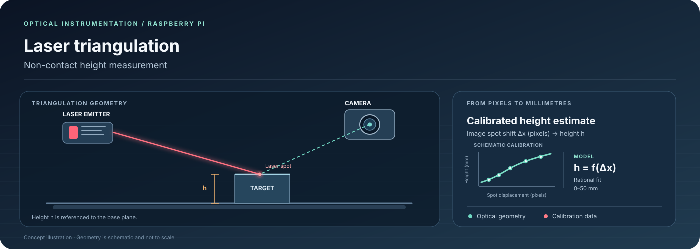
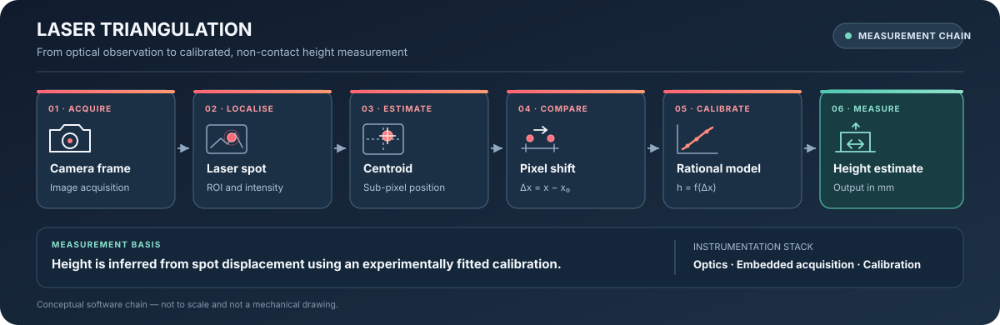

# Raspberry Pi Laser Triangulation

**A Raspberry Pi–based optical instrument for non-contact height measurement using laser triangulation and experimental calibration.**

<p align="center">
  
</p>

<p align="left">
  
  
  
  
</p>

[System](#system-overview) · [Measurement principle](#measurement-principle) · [Calibration results](#calibration-results) · [Run](#run-the-project) · [Documentation](#documentation)

---

## System overview

This system estimates object height by measuring the movement of a projected laser spot in a camera image. A Raspberry Pi captures the image, software locates the spot, and a calibration model converts measured pixel displacement into physical height.

<p align="center">
  
</p>
<p align="center"><sub>Physical prototype used for the calibration experiments.</sub></p>

### At a glance

| | |
|---|---|
| **Platform** | Raspberry Pi 4 Model B |
| **Camera** | Raspberry Pi Camera Module Rev 1.3 (OV5647) |
| **Image resolution** | 2592 × 1944 pixels |
| **Measurement principle** | Horizontal laser-spot displacement relative to a 0 mm reference |
| **Calibration model** | Rational model stored in JSON |
| **Calibration interval** | 0–50 mm |
| **Core tools** | Python · OpenCV · NumPy · SciPy · Matplotlib · Picamera2 |

## Measurement principle

The measurement principle is optical triangulation: target-height changes shift the projected laser spot in the camera image because the camera views the spot at an angle relative to the laser projection direction.


The software measures the horizontal spot coordinate relative to a freshly acquired 0 mm reference:

`Δx = x_object − x_reference`

The saved calibration model maps this displacement to an estimated physical height. This mapping depends on the optical and mechanical arrangement, so changes to camera position, laser angle, focus, or camera settings can require recalibration.

## Processing and measurement chain

<p align="center">
  
</p>

The processing chain is image acquisition, laser-spot localisation, centroid estimation, reference subtraction, calibration mapping, and recording of the measurement in CSV output. Image processing supports the measurement; the central engineering task is converting optical displacement into a calibrated height estimate.

The system is sensitive to changes in mounting, focus, illumination, and camera settings. Recalibrate after significant changes to the physical setup.

## Mechanical design and spot examples

The following photographs and design references document the physical measurement setup.

### Triangulation geometry


### 3D design reference


### Laser-spot examples


These images illustrate the target feature used by the spot-detection pipeline.

## Calibration results

The supplied model uses calibration heights of 0, 3, 6, 9, 12, 15, 18, 21, 24, 27, 30, 34, 40, 46, and 50 mm.

| Metric | Supplied result |
|---|---:|
| Selected model | Rational |
| Leave-one-out cross-validation RMSE | **0.245 mm** |
| Maximum absolute leave-one-out error | **0.510 mm** |
| Calibration interval | 0–50 mm |

> **Important:** these errors come from leave-one-out cross-validation on the calibration dataset. They are not a guarantee of accuracy on new objects or under changed conditions. Independent measurements at known heights are needed to assess real-world performance.

### Calibration plots

**Height versus horizontal pixel position**


**Calibration fit comparison**


**Leave-one-out error comparison**


**Pixel-position standard deviation**


The 40 mm calibration point has notably higher horizontal-position variation than most other supplied points and should be checked in a repeat experiment.

## Run the project

### 1. Clone

```bash
git clone https://github.com/shashank3576/raspberry-pi-laser-triangulation.git
cd raspberry-pi-laser-triangulation
```

### 2. Install dependencies on Raspberry Pi OS

The scripts use Picamera2 and the Raspberry Pi camera stack. On a compatible Raspberry Pi OS installation, a typical starting point is:

```bash
sudo apt update
sudo apt install python3-picamera2 python3-opencv python3-numpy python3-scipy python3-matplotlib
```

Package names vary by OS release. Prefer OS packages for Picamera2 and, where appropriate, OpenCV rather than assuming the camera stack will install on any desktop system.

### 3. Run calibration

```bash
python3 src/calibration.py
```

Follow the prompts to collect observations at known heights. Calibration may regenerate data, model, and analysis outputs; back up any supplied results you want to preserve before running it.

### 4. Measure object heights

```bash
python3 src/height_calculation.py
```

The script loads `data/calibration/calibration_model.json`, prompts for a current 0 mm reference and the objects to measure, and writes output to `results/measurements/height_measurement_results.csv`.

**Hardware note:** these scripts expect compatible Raspberry Pi OS camera support and configured hardware. They are not intended to run on a typical desktop without adapting the camera interface.

## Repository layout

```text
raspberry-pi-laser-triangulation/
├── src/
│   ├── calibration.py
│   └── height_calculation.py
├── data/
│   ├── raw/
│   └── calibration/
├── results/
│   ├── figures/calibration/
│   ├── measurements/
│   └── tables/
├── images/
│   ├── laser_spot/
│   └── measurement-pipeline.svg
├── docs/
│   ├── report/
│   ├── presentation/
│   ├── README.md
│   └── TECHNICAL_OVERVIEW.md
├── requirements.txt
└── README.md
```

## Key data files

| File | Purpose |
|---|---|
| `data/raw/all_measurements.csv` | Individual calibration observations |
| `data/calibration/combined_calibration_data.csv` | Aggregated calibration measurements |
| `data/calibration/calibration_model.json` | Camera/detector settings, calibration points, model, and error summary |
| `results/tables/calibration_analysis.csv` | Per-height analysis and candidate-model errors |
| `results/tables/calibration_coefficients.csv` | Candidate-model summaries and fitted parameters |
| `results/measurements/height_measurement_results.csv` | Object-height measurement output |

## Limitations and next steps

- Calibration is specific to the optical and mechanical setup.
- Cross-validation is not independent validation; test with known-height objects not used during fitting.
- The 40 mm calibration point has higher reported position variation and merits a repeat check.
- Measurements outside the calibrated pixel range use edge-slope linear extrapolation and should not be treated as validated.
- The reported uncertainty is a model-based estimate, not automatically a 95% confidence interval.

Useful next steps are independent validation, repeatability testing across sessions, automated tests for model loading and prediction boundaries, and a short real demonstration video.

## Documentation

- [Project report](docs/report/)
- [Project presentation](docs/presentation/)
- [Documentation index](docs/README.md)
- [Technical overview](docs/TECHNICAL_OVERVIEW.md)

---

<sub>Focus areas: optical measurement · embedded instrumentation · calibration · experimental characterisation</sub>
