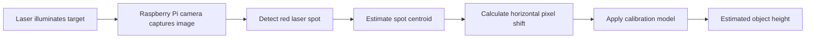

# Raspberry Pi Laser Triangulation

<p align="center">
  <strong>Camera-based object-height measurement using a red laser and pixel-displacement calibration</strong>
</p>

<p align="center">
  
  
  
  
</p>

This project estimates an object's height from the horizontal displacement of a red laser spot in images captured by a Raspberry Pi camera. It includes the calibration data, fitted model, analysis outputs, and project report/presentation.


## Contents

- [Overview](#overview)
- [How it works](#how-it-works)
- [Calibration snapshot](#calibration-snapshot)
- [Repository map](#repository-map)
- [Hardware and setup](#hardware-and-setup)
- [Run the project](#run-the-project)
- [Data and results](#data-and-results)
- [Limitations](#limitations)
- [Project documents](#project-documents)

## Overview

| Component | Details |
|---|---|
| Computing platform | Raspberry Pi 4 Model B |
| Camera | Raspberry Pi Camera Module Rev 1.3 (OV5647) |
| Image resolution | 2592 × 1944 pixels |
| Measurement signal | Horizontal laser-spot displacement relative to a 0 mm reference |
| Spot detection | Red-dominant region detection and local, background-subtracted centroid |
| Model saved with the project | Rational calibration model |
| Supplied calibration range | 0–50 mm |

## How it works



The camera, laser, and target geometry must remain fixed between calibration and measurement. The measurement script uses the current 0 mm reference to compensate for a common shift in the setup.

## Calibration snapshot

The supplied model uses reference heights of 0, 3, 6, 9, 12, 15, 18, 21, 24, 27, 30, 34, 40, 46, and 50 mm.

| Metric | Value in supplied model |
|---|---:|
| Selected model | Rational |
| Leave-one-out cross-validation RMSE | 0.245 mm |
| Maximum absolute leave-one-out error | 0.510 mm |
| Calibration interval | 0–50 mm |

> **Important:** these are cross-validation results from the calibration dataset, not a guarantee of accuracy on new objects or under changed lighting, focus, geometry, or camera settings. The 40 mm calibration point has notably higher horizontal-position variation than most other points and should be checked in a repeat experiment.

## Repository map

```text
raspberry-pi-laser-triangulation/
├── README.md                  # Project overview and quick start
├── .gitignore
├── requirements.txt
├── src/
│   ├── calibration.py         # Collect calibration data and fit models
│   └── height_calculation.py  # Estimate object heights using saved model
├── data/
│   ├── raw/
│   │   └── all_measurements.csv
│   └── calibration/
│       ├── calibration_model.json
│       └── combined_calibration_data.csv
├── results/
│   ├── figures/calibration/   # Calibration plots
│   ├── measurements/          # Height-measurement output
│   └── tables/                 # Calibration analysis tables
├── images/                    # Supporting project images
└── docs/
    ├── report/                # Project report
    └── presentation/          # Project presentation
```

## Hardware and setup

The scripts use `Picamera2` to capture images. On Raspberry Pi OS, install the camera and image-processing packages through the OS package manager. A typical starting point is:

```bash
sudo apt update
sudo apt install python3-picamera2 python3-opencv python3-numpy python3-scipy python3-matplotlib
```

Package names can vary by Raspberry Pi OS release. `Picamera2` is normally installed using Raspberry Pi OS packages rather than as an ordinary cross-platform pip dependency.

## Run the project

Run commands from the repository root.

### 1. Re-run calibration

```bash
python3 src/calibration.py
```

Follow the prompts to place the known-height calibration targets. This regenerates calibration data and analysis outputs and may overwrite supplied results. Back up any files you need to preserve before running it.

### 2. Measure object heights

```bash
python3 src/height_calculation.py
```

The script loads `data/calibration/calibration_model.json` and writes measurements to `results/measurements/height_measurement_results.csv`.

Both scripts require compatible Raspberry Pi OS camera support and connected/configured hardware; they are not expected to run as-is on a typical desktop computer.

## Data and results

| Path | Purpose |
|---|---|
| `data/raw/all_measurements.csv` | Individual spot observations collected during calibration |
| `data/calibration/combined_calibration_data.csv` | Aggregated calibration measurements |
| `data/calibration/calibration_model.json` | Camera/detector settings, calibration points, model parameters, and error summary |
| `results/tables/calibration_analysis.csv` | Per-height analysis and candidate-model errors |
| `results/tables/calibration_coefficients.csv` | Candidate-model summaries and fitted parameters |
| `results/measurements/height_measurement_results.csv` | Supplied object-height measurement output |

### Calibration figures

**Height versus horizontal pixel position**


**Leave-one-out error comparison**


**Pixel-position standard deviation**


## Limitations

- The calibration applies to the represented physical arrangement and camera settings. Recalibrate after optical, mechanical, or camera-setting changes.
- The reported cross-validation error is calculated from the calibration dataset; independent measurements at known heights are needed to assess performance on new samples.
- Measurements outside the calibrated pixel range may require extrapolation and should be treated cautiously.
- The report and presentation in `docs/` provide additional project context.

## Project documents

- **Report:** `docs/report/`
- **Presentation:** `docs/presentation/`

See [docs/README.md](docs/README.md) for the documentation index.
